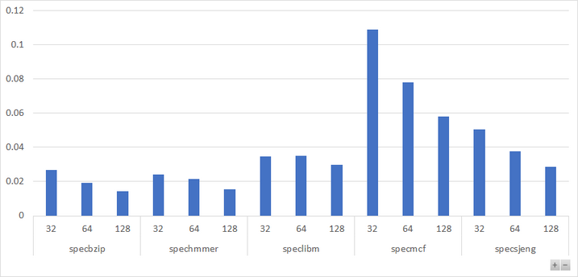
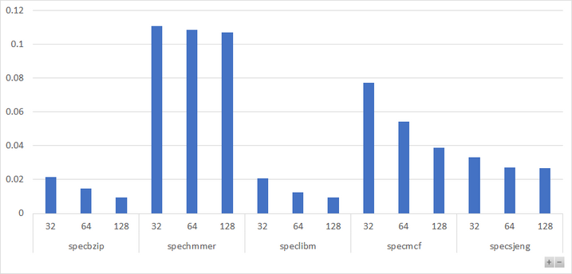

# 2η Εργασία Αρχιτεκτονικής Υπολογιστών (Ομάδα 2)

_Ραφαήλ Μπουλογεώργος, ΑΕΜ: 9186_

_Παύλος Φραγκιαδουλάκης, ΑΕΜ: 8389_

## Ερώτημα 1ο
Με βάση τη διατύπωση της εργασίας, αποσυμπιέστηκε το αρχείο _spec_cpu2006_gem5.tar.gz_ στον φάκελο εγκατάστασης του gem5. Για την μαζικό compiling και των 5 targets των benchmarks, γράφτηκε ένα νέο makefile στον φάκελο _spec_spu2006_ (στον οποίο βρίσκονται οι υποφάκελοι):
```makefile
SUBDIRS := $(wildcard */src)

all: $(SUBDIRS)
$(SUBDIRS):
	$(MAKE) -C $@

.PHONY: all $(SUBDIRS)
```
Με κλήση του make στον φάκελο _spec_cpu2006_ έχουμε δημιουργία όλων των εκτελέσιμων αρχείων.

Στο πρώτο ερώτημα μας ζητάει να εντοπίσουμε στα αρχεία εξόδου των προσομοιώσεών τα μεγέθη των caches, το associativity κάθε μίας από αυτές και το μέγεθος της cache line.

- **Specbzip**

Μέγεθος | Τιμή | Αναφορά σε αρχείο
----------------- | ----- | ------------------
L1 instruction cache | 32kB  |  [size=32768 - [config.ini]](/Step1_files/sim_results/specbzip/config.ini#L845)
L1 data caches  | 64kB  | [size=65536 - [config.ini]](/Step1_files/sim_results/specbzip/config.ini#L179)
L2 cache  | 2MB | [size=2097152 - [config.ini]](/Step1_files/sim_results/specbzip/config.ini#L1050)
Associativity L1 instruction cache  | 2 | [assoc=2 - [config.ini]](/Step1_files/sim_results/specbzip/config.ini#L832)
Associativity L1 data cache | 2 | [assoc=2 - [config.ini]](/Step1_files/sim_results/specbzip/config.ini#L159)
Associativity L2 cache | 8 | [assoc=8 - [config.ini]](/Step1_files/sim_results/specbzip/config.ini#L1037)
Cacheline size  | 64kB |  [cache_line_size=65536 - [config.ini]](/Step1_files/sim_results/specbzip/config.ini#L15)

- **Spechmmer**

Μέγεθος | Τιμή | Αναφορά σε αρχείο
----------------- | ----- | ------------------
L1 instruction cache | 32kB  |  [size=32768 - [config.ini]](/Step1_files/sim_results/spechmmer/config.ini#L813)
L1 data caches  | 64kB  | [size=65536 - [config.ini]](/Step1_files/sim_results/spechmmer/config.ini#L211)
L2 cache  | 2MB | [size=2097152 - [config.ini]](/Step1_files/sim_results/spechmmer/config.ini#L1018)
Associativity L1 instruction cache  | 2 | [assoc=2 - [config.ini]](/Step1_files/sim_results/spechmmer/config.ini#L793)
Associativity L1 data cache | 2 | [assoc=2 - [config.ini]](/Step1_files/sim_results/spechmmer/config.ini#L159)
Associativity L2 cache | 8 | [assoc=8 - [config.ini]](/Step1_files/sim_results/spechmmer/config.ini#L998)
Cacheline size  | 64kB |  [cache_line_size=65536 - [config.ini]](/Step1_files/sim_results/spechmmer/config.ini#L15)

- **Speclibm**

Μέγεθος | Τιμή | Αναφορά σε αρχείο
----------------- | ----- | ------------------
L1 instruction cache | 32kB  |  [size=32768 - [config.ini]](/Step1_files/sim_results/speclibm/config.ini#L813)
L1 data caches  | 64kB  | [size=65536 - [config.ini]](/Step1_files/sim_results/speclibm/config.ini#L211)
L2 cache  | 2MB | [size=2097152 - [config.ini]](/Step1_files/sim_results/speclibm/config.ini#L1018)
Associativity L1 instruction cache  | 2 | [assoc=2 - [config.ini]](/Step1_files/sim_results/speclibm/config.ini#L793)
Associativity L1 data cache | 2 | [assoc=2 - [config.ini]](/Step1_files/sim_results/speclibm/config.ini#L159)
Associativity L2 cache | 8 | [assoc=8 - [config.ini]](/Step1_files/sim_results/speclibm/config.ini#L998)
Cacheline size  | 64kB |  [cache_line_size=65536 - [config.ini]](/Step1_files/sim_results/speclibm/config.ini#L15)

- **Specmcf**

Μέγεθος | Τιμή | Αναφορά σε αρχείο
----------------- | ----- | ------------------
L1 instruction cache | 32kB  |  [size=32768 - [config.ini]](/Step1_files/sim_results/specmcf/config.ini#L813)
L1 data caches  | 64kB  | [size=65536 - [config.ini]](/Step1_files/sim_results/specmcf/config.ini#L211)
L2 cache  | 2MB | [size=2097152 - [config.ini]](/Step1_files/sim_results/specmcf/config.ini#L1018)
Associativity L1 instruction cache  | 2 | [assoc=2 - [config.ini]](/Step1_files/sim_results/specmcf/config.ini#L793)
Associativity L1 data cache | 2 | [assoc=2 - [config.ini]](/Step1_files/sim_results/specmcf/config.ini#L159)
Associativity L2 cache | 8 | [assoc=8 - [config.ini]](/Step1_files/sim_results/specmcf/config.ini#L998)
Cacheline size  | 64kB |  [cache_line_size=65536 - [config.ini]](/Step1_files/sim_results/specmcf/config.ini#L15)

- **Specsjeng**

Μέγεθος | Τιμή | Αναφορά σε αρχείο
----------------- | ----- | ------------------
L1 instruction cache | 32kB  |  [size=32768 - [config.ini]](/Step1_files/sim_results/specsjeng/config.ini#L813)
L1 data caches  | 64kB  | [size=65536 - [config.ini]](/Step1_files/sim_results/specsjeng/config.ini#L211)
L2 cache  | 2MB | [size=2097152 - [config.ini]](/Step1_files/sim_results/specsjeng/config.ini#L1018)
Associativity L1 instruction cache  | 2 | [assoc=2 - [config.ini]](/Step1_files/sim_results/specsjeng/config.ini#L793)
Associativity L1 data cache | 2 | [assoc=2 - [config.ini]](/Step1_files/sim_results/specsjeng/config.ini#L159)
Associativity L2 cache | 8 | [assoc=8 - [config.ini]](/Step1_files/sim_results/specsjeng/config.ini#L998)
Cacheline size  | 64kB |  [cache_line_size=65536 - [config.ini]](/Step1_files/sim_results/specsjeng/config.ini#L15)

**Είναι φανερό ότι τα μεγέθη αυτά παρεμένουν σταθερά σε όλα τα Benchmarks καθώς δεν αλλάζουμε τα ορίσματα του script *se.py*.**

## Ερώτημα 2ο

### Βήμα 1ο Εκτέλεση SPEC CPU2006 Benchmarks στον gem5
Το δεύτερο ερώτημα μας ζητάει να κρατήσουε τις ακόλουθες πληροφορίες από τα στατιστικά για κάθε Benchmark που προσομοιώσαμε.

Τα δεδομένα θα τα αντλήσουμε από το αρχείο [stats.txt](/Step1_files/sim_results/specbzip/stats.txt).

_Αναφορικά οι παραπομπές αφορούν το Benchmark Specbzip._

Πληροφορίες | Παραπομπή
------------------------  | ------------------------
Χρόνος Εκτέλεσης [1](#86)  |  [sim_seconds [stats.txt]](/Step1_files/sim_results/specbzip/stats.txt#L12)
Cycles per instruction (CPI)  | [system.cpu.cpi [stats.txt]](/Step1_files/sim_results/specbzip/stats.txt#L29)
Συνολικά miss rates L1 Data cache | [system.cpu.dcache.overall_miss_rate::total [stats.txt]](/Step1_files/sim_results/specbzip/stats.txt#L867)
Συνολικά miss rates L1 instruction cache | [system.cpu.icache.overall_miss_rate::total [stats.txt]](/Step1_files/sim_results/specbzip/stats.txt#L780)
Συνολικά miss rates L2 cache | [system.l2.overall_miss_rate::total [stats.txt]](/Step1_files/sim_results/specbzip/stats.txt#L320)

*[1](#80): Αναφερόμαστε στον χρόνο εκτέλεσης του Benchmark και όχι τον συνολικό χρόνο προσομοίωσης.*

Δεδομένα/Benchmark  |  Χρόνος Εκτέλεσης | Cycles per instruction (CPI)  | Total miss-rate L1 Data  | Total miss-rate L1 Instruction | Total miss-rate rates L2
-------------------- | ---------------------- | -------------------------- | ------------------------- | -------------------------- | ----------------
401.bzip2 *(specbzip)* |  0.084159	| 1.683172 |	0.014840 |	0.000074 |	0.281708
470.lbm *(speclibm)*  | 0.174681 |	3.493611 |	0.060971 |	0.000099 |	0.999927
456.hmmer *(spechmmer)* | 0.059368 |	1.187362|	0.001645 |	0.000205 |	0.082246
458.sjeng *(specsjeng)* | 0.513541 |	10.270810	| 0.121829 |	0.000020 |	0.999979
429.mcf *(specmcf)* | 0.055477 |	1.109538 |	0.002051 |	0.000037 |	0.724040

- **Χρόνος Εκτέλεσης**


- **Cycles per instruction (CPI)**

")

- **Total miss-rate L1 Data**


- **Total miss-rate L1 Instruction**


- **Total miss-rate L2 Cache**


- **Συμπέρασματα Γραφημάτων**

Από τα γραφήματα μπορούμε να βγάλουμε συμπεράσματα σχετικά με τον τρόπο που λειτουργούν τα Benchmarks αλλά και τις αδυναμίες της αντίστοιχης αρχιτεκτονικής.

Αρχικά βλέπουμε ότι οι διαφορές στα miss-rates στην L1 Instruction Cache είναι αμελητέες και δεν επηρεάζουν το συνολικό χρόνο εκτέλεσης των προγραμμάτων. Παρόλα αυτά το Spechmmer φαίνεται να έχει συγκριτικά μεγαλύτερο ποσοστό miss-rate στην instruction Cache κάτι που μας κάνει να συμπεράνουμε ότι η εντολές δεν βρίσκονται πάντα η μία κοντά στην άλλη, δηλαδή υπάρχουν πολλά branches σε διάφορα σημεία του κώδικα ή ότι το μέγεθος στην L1 δεν είναι αρκετά μεγάλο για τις απαιτήσεις του προγράμματος.

Αντίθετα τα miss-rate της L1 Data cache επηρεάζουν καθοριστικά τον χρόνο εκτέλεσης. Για το Specsjeng με αρκετά μεγάλο ποσοστό misses σε σχέση με τα υπόλοιπα βλέπουμε ότι ο χρόνος αυξάνεται σημαντικά. Με βάση αυτό μπορούμε να συμπεράνουμε ότι το μέγεθος της L1 Data Cache δεν επαρκεί ή ότι τα δεδομένα που χρειάζεται το πρόγραμμα δεν βρίσκονται δε γειτονικές θέσεις μνήμης με αποτέλεσμα να μην ακολουθούν την τοπικότητα και να αυξάνουν το miss-rate. Το γεγονός αυτό επαληθεύεται και από το διάγραμμα της L2 Cache στο οποίο βλέπουμε ότι σχεδόν κάθε φορά που αναζητούσε εκεί δεδομένα είχε miss. Αντίστοιχα αποτελέσματα συμπεραίνουμε και από το Speclibm .

### Βήμα 2ο Design Exploration – Βελτιστοποίηση απόδοσης

Για την εύρεση της επίπτωσης στην απόδοση στις διάφορες παραμέτρους που εξετάζουμε, τα παρακάτω εύρη που αναφέρονται παρακάτω. Να σημειωθεί ότι το μέγεθος των Data/Instruction για την L1 είναι επιλεγμένο έτσι ώστε να το άθροισμά τους να μην υπερβαίνει τα 256 kB:
  * L1 Data/Instruction Size [kB]: 128/128, 128/64, 32/128, **32/64**, 64/128, 64/64
  * L2 Size [kB]: **512**, 1024, 2048, 4096
  * L1 Instruction Associativity: **1**, 2, 4
  * L1 Data Associativity: **1**, 2, 4
  * L2 Data Associativity: 1, **2**, 4
  * Cacheline Size: 32, **64**, 128
  
Στα παραπάνω, με έντονη γραμματοσειρά σημειώνονται οι default τιμές. 
Ο αριθμός των instructions που εκτελέστηκε είναι ίσος με 100000, γεγονός που επηρέασε τη μη σημαντική επίπτωση των μεταβολών του L1 instruction size, το οποίο θα ήταν αναμενόμενο. 

Χαρακτηριστικές επιπτώσεις των μεταβαλλόμενων παραμέτρων φαίνονται στα παρακάτω γραφήματα:

* L1D-L1I size effect to CPI


* Cache Line effect to CPI


* Cache Line effect to L1I miss rate


* Cache Line effect to L1D miss rate



### Βήμα 3ο Κόστος απόδοσης και βελτιστοποίηση κόστους/απόδοσης
Παρακάτω επισυνάπτεται ο συνολικός πίνακας των αποτελεσμάτων. 

Η βέλτιστη επιλογή των παραμέτρων γίνεται εδώ με βάση το γινόμενο COST\*AMAT. Θέλουμε το λίγοτερο δυνατό κόστος και τον μικρότερο δυνατό χρόνο, συνεπώς η καλύτερη επιλογή για κάθε benchmark είναι εκείνη με την μικρότερη τιμή.
Εναλλακτικά θα μπορούσαμε να πάρουμε την μεγαλύτερη τιμή του λόγου Performance/Cost = 1/ (AMAT x Cost), όπου η απόδοση θα ήταν το 1/AMAT. 
Η σχέση του AMAT προκύπτει από την βιβλιογραφία βάζοντας συμβατικούς συντελεστές για τα HitRate, αλλά χρησιμοποιώντας τις μετρούμενες τιμές από το gem5 όσον αφορά τα MissRateL1 = (Miss Rate Instruction + Miss Rate Data Cache) και MissRateL2:

**ΑΜΑΤ = HitRateL1 + MissRateL1 x (HitRateL2 + MissRateL2 x MissPenaltyL2)** ή

**AMAT = 1 + (system.cpu.dcache.overall_miss_rate::total + system.cpu.icache.overall_miss_rate::total) x (10 + system.l2.overall_miss_rate::total
 x 100)**
 
Για το κόστος χρησιμοποιούμε την (εμπειρική) συνάρτηση θεωρώντας δεδομένη περίπου μία τάξη μεγέθους στο κόστος L1, L2:

**COST = (L1 Data Size + L1 Instr Size)/128 x 10 + (L1 Data Assoc)/4 x 10 + (L2 Size)/4096 x 1 + (Cache Line)/128 x 10**

Στα παραπάνω έχουμε ανάγει κάθε μέγεθος αθροιστή σε ένα τυπικό εύρος [0,1] πριν γίνει πολ/σμός με ένα συγκριτικό συντελεστή κόστους.


| Benchmark path                                  | Benchmark | Scenario          | L1 Data Size [kB] | L1 Instr Size [kB] | L1 Data Assoc | L1 Instr Assoc | L2 Size [kB] | Cache Line | L2 Data Assoc | system.cpu.cpi | system.cpu.dcache.overall_miss_rate::total | system.cpu.icache.overall_miss_rate::total | system.l2.overall_miss_rate::total | AMAT        | Cost   | COST*AMAT   |
|-------------------------------------------------|-----------|-------------------|-------------------|--------------------|---------------|----------------|--------------|------------|---------------|----------------|--------------------------------------------|--------------------------------------------|------------------------------------|-------------|--------|-------------|
| ./Benchmarks_results/specbzip/l2d_assoc.1       | specbzip  | L2D Associativity | 32                | 64                 | 1             | 1              | 512          | 64         | 1             | 1.85818        | 0.014602                                   | 0.019378                                   | 0.921962                           | 4.472626876 | 16.375 | 73.23926509 |
| ./Benchmarks_results/specbzip/l2d_assoc.2       | specbzip  | L2D Associativity | 32                | 64                 | 1             | 1              | 512          | 64         | 2             | 1.85818        | 0.014602                                   | 0.019378                                   | 0.921962                           | 4.472626876 | 16.375 | 73.23926509 |
| ./Benchmarks_results/specbzip/l2d_assoc.4       | specbzip  | L2D Associativity | 32                | 64                 | 1             | 1              | 512          | 64         | 4             | 1.85818        | 0.014602                                   | 0.019378                                   | 0.921962                           | 4.472626876 | 16.375 | 73.23926509 |
| ./Benchmarks_results/specbzip/cacheline.128     | specbzip  | Cache Line        | 32                | 64                 | 1             | 1              | 512          | 128        | 2             | 1.64059        | 0.009367                                   | 0.014421                                   | 0.841935                           | 3.240674978 | 21.375 | 69.26942765 |
| ./Benchmarks_results/specbzip/cacheline.32      | specbzip  | Cache Line        | 32                | 64                 | 1             | 1              | 512          | 32         | 2             | 2.25272        | 0.021676                                   | 0.026819                                   | 0.960112                           | 6.141013144 | 13.875 | 85.20655737 |
| ./Benchmarks_results/specbzip/cacheline.64      | specbzip  | Cache Line        | 32                | 64                 | 1             | 1              | 512          | 64         | 2             | 1.85818        | 0.014602                                   | 0.019378                                   | 0.921962                           | 4.472626876 | 16.375 | 73.23926509 |
| ./Benchmarks_results/specbzip/l1d128kB.li128kB  | specbzip  | L1D/L1I Size      | 128               | 128                | 1             | 1              | 512          | 64         | 2             | 1.097575       | 0.00222                                    | 0.000029                                   | 0.791926                           | 1.200594157 | 28.875 | 34.66715629 |
| ./Benchmarks_results/specbzip/l1d128kB.li64kB   | specbzip  | L1D/L1I Size      | 128               | 64                 | 1             | 1              | 512          | 64         | 2             | 1.097653       | 0.00222                                    | 0.000035                                   | 0.789952                           | 1.200684176 | 23.875 | 28.6663347  |
| ./Benchmarks_results/specbzip/l1d32kB.li128kB   | specbzip  | L1D/L1I Size      | 32                | 128                | 1             | 1              | 512          | 64         | 2             | 1.102321       | 0.003232                                   | 0.000029                                   | 0.542108                           | 1.209391419 | 21.375 | 25.85074158 |
| ./Benchmarks_results/specbzip/l1d32kB.li64kB    | specbzip  | L1D/L1I Size      | 32                | 64                 | 1             | 1              | 512          | 64         | 2             | 1.102246       | 0.003232                                   | 0.000034                                   | 0.541189                           | 1.209412327 | 16.375 | 19.80412686 |
| ./Benchmarks_results/specbzip/l1d64kB.li128kB   | specbzip  | L1D/L1I Size      | 64                | 128                | 1             | 1              | 512          | 64         | 2             | 1.099474       | 0.002561                                   | 0.000029                                   | 0.682814                           | 1.202748826 | 23.875 | 28.71562822 |
| ./Benchmarks_results/specbzip/l1d64kB.li64kB    | specbzip  | L1D/L1I Size      | 64                | 64                 | 1             | 1              | 512          | 64         | 2             | 1.099343       | 0.00256                                    | 0.000034                                   | 0.681334                           | 1.20267804  | 18.875 | 22.700548   |
| ./Benchmarks_results/specbzip/l1d_assoc.1       | specbzip  | L1D Associativity | 32                | 64                 | 1             | 1              | 512          | 64         | 2             | 1.85818        | 0.014602                                   | 0.019378                                   | 0.921962                           | 4.472626876 | 16.375 | 73.23926509 |
| ./Benchmarks_results/specbzip/l1d_assoc.2       | specbzip  | L1D Associativity | 32                | 64                 | 2             | 1              | 512          | 64         | 2             | 1.85818        | 0.013848                                   | 0.019381                                   | 0.950575                           | 4.490955668 | 18.875 | 84.76678822 |
| ./Benchmarks_results/specbzip/l1d_assoc.4       | specbzip  | L1D Associativity | 32                | 64                 | 4             | 1              | 512          | 64         | 2             | 1.85818        | 0.013848                                   | 0.019381                                   | 0.950575                           | 4.490955668 | 23.875 | 107.2215666 |
| ./Benchmarks_results/specbzip/l1i_assoc.1       | specbzip  | L1I Associativity | 32                | 64                 | 1             | 1              | 512          | 64         | 2             | 1.102246       | 0.003232                                   | 0.000034                                   | 0.541189                           | 1.209412327 | 16.375 | 19.80412686 |
| ./Benchmarks_results/specbzip/l1i_assoc.2       | specbzip  | L1I Associativity | 32                | 64                 | 1             | 2              | 512          | 64         | 2             | 1.102321       | 0.003232                                   | 0.000019                                   | 0.543669                           | 1.209256792 | 17.625 | 21.31315096 |
| ./Benchmarks_results/specbzip/l1i_assoc.4       | specbzip  | L1I Associativity | 32                | 64                 | 1             | 4              | 512          | 64         | 2             | 1.102243       | 0.003232                                   | 0.000019                                   | 0.543695                           | 1.209265245 | 20.125 | 24.33646305 |
| ./Benchmarks_results/specbzip/l2_size.1MB       | specbzip  | L2 Size           | 32                | 64                 | 1             | 1              | 1024         | 64         | 2             | 1.099771       | 0.003231                                   | 0.000034                                   | 0.497559                           | 1.195103014 | 16.5   | 19.71919972 |
| ./Benchmarks_results/specbzip/l2_size.2MB       | specbzip  | L2 Size           | 32                | 64                 | 1             | 1              | 2048         | 64         | 2             | 1.09768        | 0.003231                                   | 0.000034                                   | 0.464776                           | 1.184399364 | 16.75  | 19.83868935 |
| ./Benchmarks_results/specbzip/l2_size.4MB       | specbzip  | L2 Size           | 32                | 64                 | 1             | 1              | 4096         | 64         | 2             | 1.097524       | 0.003231                                   | 0.000034                                   | 0.461612                           | 1.183366318 | 17.25  | 20.41306899 |
| ./Benchmarks_results/specbzip/l2_size.512kB     | specbzip  | L2 Size           | 32                | 64                 | 1             | 1              | 512          | 64         | 2             | 1.102246       | 0.003232                                   | 0.000034                                   | 0.541189                           | 1.209412327 | 16.375 | 19.80412686 |
| ./Benchmarks_results/spechmmer/l2d_assoc.1      | specbzip  | L2D Associativity | 32                | 64                 | 1             | 1              | 512          | 64         | 1             | 3.78268        | 0.108453                                   | 0.02145                                    | 0.989542                           | 15.15347744 | 16.375 | 248.1381931 |
| ./Benchmarks_results/spechmmer/l2d_assoc.2      | specbzip  | L2D Associativity | 32                | 64                 | 1             | 1              | 512          | 64         | 2             | 3.78268        | 0.108453                                   | 0.02145                                    | 0.989542                           | 15.15347744 | 16.375 | 248.1381931 |
| ./Benchmarks_results/spechmmer/l2d_assoc.4      | specbzip  | L2D Associativity | 32                | 64                 | 1             | 1              | 512          | 64         | 4             | 3.78268        | 0.108453                                   | 0.02145                                    | 0.989542                           | 15.15347744 | 16.375 | 248.1381931 |
| ./Benchmarks_results/spechmmer/cacheline.128    | spechmmer | Cache Line        | 32                | 64                 | 1             | 1              | 512          | 128        | 2             | 3.97972        | 0.10704                                    | 0.015566                                   | 0.988068                           | 14.34036652 | 21.375 | 306.5253344 |
| ./Benchmarks_results/spechmmer/cacheline.32     | spechmmer | Cache Line        | 32                | 64                 | 1             | 1              | 512          | 32         | 2             | 4.04386        | 0.110869                                   | 0.024125                                   | 0.991266                           | 15.73143624 | 13.875 | 218.2736778 |
| ./Benchmarks_results/spechmmer/cacheline.64     | spechmmer | Cache Line        | 32                | 64                 | 1             | 1              | 512          | 64         | 2             | 3.78268        | 0.108453                                   | 0.02145                                    | 0.989542                           | 15.15347744 | 16.375 | 248.1381931 |
| ./Benchmarks_results/spechmmer/l1d128kB.li128kB | spechmmer | L1D/L1I Size      | 128               | 128                | 1             | 1              | 512          | 64         | 2             | 1.657078       | 0.014063                                   | 0.000072                                   | 0.421743                           | 1.737483731 | 28.875 | 50.16984272 |
| ./Benchmarks_results/spechmmer/l1d128kB.li64kB  | spechmmer | L1D/L1I Size      | 128               | 64                 | 1             | 1              | 512          | 64         | 2             | 1.657078       | 0.014061                                   | 0.000076                                   | 0.421736                           | 1.737578183 | 23.875 | 41.48467912 |
| ./Benchmarks_results/spechmmer/l1d32kB.li128kB  | spechmmer | L1D/L1I Size      | 32                | 128                | 1             | 1              | 512          | 64         | 2             | 1.727746       | 0.021398                                   | 0.000072                                   | 0.271812                           | 1.798280364 | 21.375 | 38.43824278 |
| ./Benchmarks_results/spechmmer/l1d32kB.li64kB   | spechmmer | L1D/L1I Size      | 32                | 64                 | 1             | 1              | 512          | 64         | 2             | 1.727746       | 0.021398                                   | 0.000076                                   | 0.271811                           | 1.798426941 | 16.375 | 29.44924117 |
| ./Benchmarks_results/spechmmer/l1d64kB.li128kB  | spechmmer | L1D/L1I Size      | 64                | 128                | 1             | 1              | 512          | 64         | 2             | 1.693686       | 0.017754                                   | 0.000072                                   | 0.329703                           | 1.765988568 | 23.875 | 42.16297706 |
| ./Benchmarks_results/spechmmer/l1d64kB.li64kB   | spechmmer | L1D/L1I Size      | 64                | 64                 | 1             | 1              | 512          | 64         | 2             | 1.693686       | 0.017754                                   | 0.000076                                   | 0.329702                           | 1.766158666 | 18.875 | 33.33624482 |
| ./Benchmarks_results/spechmmer/l1d_assoc.1      | spechmmer | L1D Associativity | 32                | 64                 | 1             | 1              | 512          | 64         | 2             | 3.78268        | 0.108453                                   | 0.02145                                    | 0.989542                           | 15.15347744 | 16.375 | 248.1381931 |
| ./Benchmarks_results/spechmmer/l1d_assoc.2      | spechmmer | L1D Associativity | 32                | 64                 | 2             | 1              | 512          | 64         | 2             | 3.84503        | 0.108347                                   | 0.021456                                   | 0.990467                           | 15.1545888  | 18.875 | 286.0428636 |
| ./Benchmarks_results/spechmmer/l1d_assoc.4      | spechmmer | L1D Associativity | 32                | 64                 | 4             | 1              | 512          | 64         | 2             | 3.84503        | 0.108347                                   | 0.021456                                   | 0.990467                           | 15.1545888  | 23.875 | 361.8158076 |
| ./Benchmarks_results/spechmmer/l1i_assoc.1      | spechmmer | L1I Associativity | 32                | 64                 | 1             | 1              | 512          | 64         | 2             | 1.727746       | 0.021398                                   | 0.000076                                   | 0.271811                           | 1.798426941 | 16.375 | 29.44924117 |
| ./Benchmarks_results/spechmmer/l1i_assoc.2      | spechmmer | L1I Associativity | 32                | 64                 | 1             | 2              | 512          | 64         | 2             | 1.727696       | 0.021396                                   | 0.00007                                    | 0.271806                           | 1.79811876  | 17.625 | 31.69184314 |
| ./Benchmarks_results/spechmmer/l1i_assoc.4      | spechmmer | L1I Associativity | 32                | 64                 | 1             | 4              | 512          | 64         | 2             | 1.727791       | 0.021397                                   | 0.000067                                   | 0.271813                           | 1.798059423 | 20.125 | 36.18594589 |
| ./Benchmarks_results/spechmmer/l2_size.1MB      | spechmmer | L2 Size           | 32                | 64                 | 1             | 1              | 1024         | 64         | 2             | 1.701162       | 0.021405                                   | 0.000076                                   | 0.224366                           | 1.696770605 | 16.5   | 27.99671498 |
| ./Benchmarks_results/spechmmer/l2_size.2MB      | spechmmer | L2 Size           | 32                | 64                 | 1             | 1              | 2048         | 64         | 2             | 1.684597       | 0.021403                                   | 0.000076                                   | 0.197444                           | 1.638879968 | 16.75  | 27.45123946 |
| ./Benchmarks_results/spechmmer/l2_size.4MB      | spechmmer | L2 Size           | 32                | 64                 | 1             | 1              | 4096         | 64         | 2             | 1.666818       | 0.021403                                   | 0.000076                                   | 0.170211                           | 1.580386207 | 17.25  | 27.26166207 |
| ./Benchmarks_results/spechmmer/l2_size.512kB    | spechmmer | L2 Size           | 32                | 64                 | 1             | 1              | 512          | 64         | 2             | 1.727746       | 0.021398                                   | 0.000076                                   | 0.271811                           | 1.798426941 | 16.375 | 29.44924117 |
| ./Benchmarks_results/speclibm/l2d_assoc.1       | speclibm  | L2D Associativity | 32                | 64                 | 1             | 1              | 512          | 64         | 1             | 1.79568        | 0.012316                                   | 0.034881                                   | 0.90681                            | 5.751841157 | 16.375 | 94.18639895 |
| ./Benchmarks_results/speclibm/l2d_assoc.2       | speclibm  | L2D Associativity | 32                | 64                 | 1             | 1              | 512          | 64         | 2             | 1.79568        | 0.012316                                   | 0.034881                                   | 0.90681                            | 5.751841157 | 16.375 | 94.18639895 |
| ./Benchmarks_results/speclibm/l2d_assoc.4       | speclibm  | L2D Associativity | 32                | 64                 | 1             | 1              | 512          | 64         | 4             | 1.79568        | 0.012316                                   | 0.034881                                   | 0.90681                            | 5.751841157 | 16.375 | 94.18639895 |
| ./Benchmarks_results/speclibm/cacheline.128     | speclibm  | Cache Line        | 32                | 64                 | 1             | 1              | 512          | 128        | 2             | 1.6674         | 0.0093                                     | 0.02971                                    | 0.79803                            | 4.50321503  | 21.375 | 96.25622127 |
| ./Benchmarks_results/speclibm/cacheline.32      | speclibm  | Cache Line        | 32                | 64                 | 1             | 1              | 512          | 32         | 2             | 2.07542        | 0.020618                                   | 0.034863                                   | 0.959792                           | 6.879831995 | 13.875 | 95.45766893 |
| ./Benchmarks_results/speclibm/cacheline.64      | speclibm  | Cache Line        | 32                | 64                 | 1             | 1              | 512          | 64         | 2             | 1.79568        | 0.012316                                   | 0.034881                                   | 0.90681                            | 5.751841157 | 16.375 | 94.18639895 |
| ./Benchmarks_results/speclibm/l1d128kB.li128kB  | speclibm  | L1D/L1I Size      | 128               | 128                | 1             | 1              | 512          | 64         | 2             | 7.041453       | 0.121845                                   | 0.000019                                   | 0.999742                           | 14.40189591 | 28.875 | 415.8547444 |
| ./Benchmarks_results/speclibm/l1d128kB.li64kB   | speclibm  | L1D/L1I Size      | 128               | 64                 | 1             | 1              | 512          | 64         | 2             | 7.041481       | 0.121845                                   | 0.00002                                    | 0.999735                           | 14.40192058 | 23.875 | 343.8458538 |
| ./Benchmarks_results/speclibm/l1d32kB.li128kB   | speclibm  | L1D/L1I Size      | 32                | 128                | 1             | 1              | 512          | 64         | 2             | 7.042241       | 0.121913                                   | 0.000019                                   | 0.998637                           | 14.39590067 | 21.375 | 307.7123768 |
| ./Benchmarks_results/speclibm/l1d32kB.li64kB    | speclibm  | L1D/L1I Size      | 32                | 64                 | 1             | 1              | 512          | 64         | 2             | 7.042241       | 0.121912                                   | 0.00002                                    | 0.99863                            | 14.39581532 | 16.375 | 235.7314758 |
| ./Benchmarks_results/speclibm/l1d64kB.li128kB   | speclibm  | L1D/L1I Size      | 64                | 128                | 1             | 1              | 512          | 64         | 2             | 7.041767       | 0.12187                                    | 0.000019                                   | 0.999334                           | 14.39967219 | 23.875 | 343.7921736 |
| ./Benchmarks_results/speclibm/l1d64kB.li64kB    | speclibm  | L1D/L1I Size      | 64                | 64                 | 1             | 1              | 512          | 64         | 2             | 7.041776       | 0.12187                                    | 0.00002                                    | 0.999327                           | 14.3996968  | 18.875 | 271.7942772 |
| ./Benchmarks_results/speclibm/l1d_assoc.1       | speclibm  | L1D Associativity | 32                | 64                 | 1             | 1              | 512          | 64         | 2             | 1.79568        | 0.012316                                   | 0.034881                                   | 0.90681                            | 5.751841157 | 16.375 | 94.18639895 |
| ./Benchmarks_results/speclibm/l1d_assoc.2       | speclibm  | L1D Associativity | 32                | 64                 | 2             | 1              | 512          | 64         | 2             | 1.79568        | 0.01093                                    | 0.034885                                   | 0.965649                           | 5.882270894 | 18.875 | 111.0278631 |
| ./Benchmarks_results/speclibm/l1d_assoc.4       | speclibm  | L1D Associativity | 32                | 64                 | 4             | 1              | 512          | 64         | 2             | 1.79568        | 0.01093                                    | 0.034885                                   | 0.965649                           | 5.882270894 | 23.875 | 140.4392176 |
| ./Benchmarks_results/speclibm/l1i_assoc.1       | speclibm  | L1I Associativity | 32                | 64                 | 1             | 1              | 512          | 64         | 2             | 7.042241       | 0.121912                                   | 0.00002                                    | 0.99863                            | 14.39581532 | 16.375 | 235.7314758 |
| ./Benchmarks_results/speclibm/l1i_assoc.2       | speclibm  | L1I Associativity | 32                | 64                 | 1             | 2              | 512          | 64         | 2             | 7.042218       | 0.121913                                   | 0.000019                                   | 0.998638                           | 14.39591286 | 17.625 | 253.7279642 |
| ./Benchmarks_results/speclibm/l1i_assoc.4       | speclibm  | L1I Associativity | 32                | 64                 | 1             | 4              | 512          | 64         | 2             | 7.042256       | 0.121913                                   | 0.000019                                   | 0.998638                           | 14.39591286 | 20.125 | 289.7177463 |
| ./Benchmarks_results/speclibm/l2_size.1MB       | speclibm  | L2 Size           | 32                | 64                 | 1             | 1              | 1024         | 64         | 2             | 7.041927       | 0.121912                                   | 0.00002                                    | 0.99863                            | 14.39581532 | 16.5   | 237.5309527 |
| ./Benchmarks_results/speclibm/l2_size.2MB       | speclibm  | L2 Size           | 32                | 64                 | 1             | 1              | 2048         | 64         | 2             | 7.041123       | 0.121912                                   | 0.00002                                    | 0.99863                            | 14.39581532 | 16.75  | 241.1299065 |
| ./Benchmarks_results/speclibm/l2_size.4MB       | speclibm  | L2 Size           | 32                | 64                 | 1             | 1              | 4096         | 64         | 2             | 7.039496       | 0.121912                                   | 0.00002                                    | 0.99863                            | 14.39581532 | 17.25  | 248.3278142 |
| ./Benchmarks_results/speclibm/l2_size.512kB     | speclibm  | L2 Size           | 32                | 64                 | 1             | 1              | 512          | 64         | 2             | 7.042241       | 0.121912                                   | 0.00002                                    | 0.99863                            | 14.39581532 | 16.375 | 235.7314758 |
| ./Benchmarks_results/specmcf/l2d_assoc.1        | specmcf   | L2D Associativity | 32                | 64                 | 1             | 1              | 512          | 64         | 1             | 4.523777       | 0.054129                                   | 0.077973                                   | 0.892922                           | 14.1166982  | 16.375 | 231.1609331 |
| ./Benchmarks_results/specmcf/l2d_assoc.2        | specmcf   | L2D Associativity | 32                | 64                 | 1             | 1              | 512          | 64         | 2             | 4.523777       | 0.054129                                   | 0.077973                                   | 0.892922                           | 14.1166982  | 16.375 | 231.1609331 |
| ./Benchmarks_results/specmcf/l2d_assoc.4        | specmcf   | L2D Associativity | 32                | 64                 | 1             | 1              | 512          | 64         | 4             | 4.523777       | 0.054129                                   | 0.077973                                   | 0.892922                           | 14.1166982  | 16.375 | 231.1609331 |
| ./Benchmarks_results/specmcf/cacheline.128      | specmcf   | Cache Line        | 32                | 64                 | 1             | 1              | 512          | 128        | 2             | 3.77849        | 0.03885                                    | 0.058011                                   | 0.856041                           | 10.26030873 | 21.375 | 219.3140991 |
| ./Benchmarks_results/specmcf/cacheline.32       | specmcf   | Cache Line        | 32                | 64                 | 1             | 1              | 512          | 32         | 2             | 6.2138         | 0.077136                                   | 0.10876                                    | 0.94686                            | 20.46070866 | 13.875 | 283.8923326 |
| ./Benchmarks_results/specmcf/cacheline.64       | specmcf   | Cache Line        | 32                | 64                 | 1             | 1              | 512          | 64         | 2             | 4.523777       | 0.054129                                   | 0.077973                                   | 0.892922                           | 14.1166982  | 16.375 | 231.1609331 |
| ./Benchmarks_results/specmcf/l1d128kB.li128kB   | specmcf   | L1D/L1I Size      | 128               | 128                | 1             | 1              | 512          | 64         | 2             | 4.450576       | 0.044307                                   | 0.077877                                   | 0.957198                           | 13.91726804 | 28.875 | 401.8611147 |
| ./Benchmarks_results/specmcf/l1d128kB.li64kB    | specmcf   | L1D/L1I Size      | 128               | 64                 | 1             | 1              | 512          | 64         | 2             | 4.450576       | 0.044307                                   | 0.078312                                   | 0.953488                           | 13.91776451 | 23.875 | 332.2866276 |
| ./Benchmarks_results/specmcf/l1d32kB.li128kB    | specmcf   | L1D/L1I Size      | 32                | 128                | 1             | 1              | 512          | 64         | 2             | 4.516373       | 0.054129                                   | 0.07754                                    | 0.896175                           | 14.11653661 | 21.375 | 301.74097   |
| ./Benchmarks_results/specmcf/l1d32kB.li64kB     | specmcf   | L1D/L1I Size      | 32                | 64                 | 1             | 1              | 512          | 64         | 2             | 4.523777       | 0.054129                                   | 0.077973                                   | 0.892922                           | 14.1166982  | 16.375 | 231.1609331 |
| ./Benchmarks_results/specmcf/l1d64kB.li128kB    | specmcf   | L1D/L1I Size      | 64                | 128                | 1             | 1              | 512          | 64         | 2             | 4.450576       | 0.044307                                   | 0.077877                                   | 0.957198                           | 13.91726804 | 23.875 | 332.2747745 |
| ./Benchmarks_results/specmcf/l1d64kB.li64kB     | specmcf   | L1D/L1I Size      | 64                | 64                 | 1             | 1              | 512          | 64         | 2             | 4.450576       | 0.044307                                   | 0.078312                                   | 0.953488                           | 13.91776451 | 18.875 | 262.6978051 |
| ./Benchmarks_results/specmcf/l1d_assoc.1        | specmcf   | L1D Associativity | 32                | 64                 | 1             | 1              | 512          | 64         | 2             | 4.523777       | 0.054129                                   | 0.077973                                   | 0.892922                           | 14.1166982  | 16.375 | 231.1609331 |
| ./Benchmarks_results/specmcf/l1d_assoc.2        | specmcf   | L1D Associativity | 32                | 64                 | 2             | 1              | 512          | 64         | 2             | 4.450576       | 0.044735                                   | 0.078261                                   | 0.949807                           | 13.91220618 | 18.875 | 262.5928916 |
| ./Benchmarks_results/specmcf/l1d_assoc.4        | specmcf   | L1D Associativity | 32                | 64                 | 4             | 1              | 512          | 64         | 2             | 4.450576       | 0.044307                                   | 0.078312                                   | 0.953488                           | 13.91776451 | 23.875 | 332.2866276 |
| ./Benchmarks_results/specmcf/l1i_assoc.1        | specmcf   | L1I Associativity | 32                | 64                 | 1             | 1              | 512          | 64         | 2             | 4.523777       | 0.054129                                   | 0.077973                                   | 0.892922                           | 14.1166982  | 16.375 | 231.1609331 |
| ./Benchmarks_results/specmcf/l1i_assoc.2        | specmcf   | L1I Associativity | 32                | 64                 | 1             | 2              | 512          | 64         | 2             | 4.516373       | 0.054129                                   | 0.077306                                   | 0.89781                            | 14.11471574 | 17.625 | 248.7718648 |
| ./Benchmarks_results/specmcf/l1i_assoc.4        | specmcf   | L1I Associativity | 32                | 64                 | 1             | 4              | 512          | 64         | 2             | 4.516373       | 0.054129                                   | 0.076623                                   | 0.902752                           | 14.11118295 | 20.125 | 283.9875569 |
| ./Benchmarks_results/specmcf/l2_size.1MB        | specmcf   | L2 Size           | 32                | 64                 | 1             | 1              | 1024         | 64         | 2             | 4.523777       | 0.054129                                   | 0.077973                                   | 0.892922                           | 14.1166982  | 16.5   | 232.9255204 |
| ./Benchmarks_results/specmcf/l2_size.2MB        | specmcf   | L2 Size           | 32                | 64                 | 1             | 1              | 2048         | 64         | 2             | 4.523777       | 0.054129                                   | 0.077973                                   | 0.892922                           | 14.1166982  | 16.75  | 236.4546949 |
| ./Benchmarks_results/specmcf/l2_size.4MB        | specmcf   | L2 Size           | 32                | 64                 | 1             | 1              | 4096         | 64         | 2             | 4.523777       | 0.054129                                   | 0.077973                                   | 0.892922                           | 14.1166982  | 17.25  | 243.513044  |
| ./Benchmarks_results/specmcf/l2_size.512kB      | specmcf   | L2 Size           | 32                | 64                 | 1             | 1              | 512          | 64         | 2             | 4.523777       | 0.054129                                   | 0.077973                                   | 0.892922                           | 14.1166982  | 16.375 | 231.1609331 |
| ./Benchmarks_results/specsjeng/l2d_assoc.1      | specsjeng | L2D Associativity | 32                | 64                 | 1             | 1              | 512          | 64         | 1             | 2.71385        | 0.027327                                   | 0.037788                                   | 0.6801                             | 6.07962115  | 16.375 | 99.55379633 |
| ./Benchmarks_results/specsjeng/l2d_assoc.2      | specsjeng | L2D Associativity | 32                | 64                 | 1             | 1              | 512          | 64         | 2             | 2.70883        | 0.027327                                   | 0.037788                                   | 0.678607                           | 6.069899481 | 16.375 | 99.39460399 |
| ./Benchmarks_results/specsjeng/l2d_assoc.4      | specsjeng | L2D Associativity | 32                | 64                 | 1             | 1              | 512          | 64         | 4             | 2.70882        | 0.027328                                   | 0.037773                                   | 0.678109                           | 6.065567401 | 16.375 | 99.32366619 |
| ./Benchmarks_results/specsjeng/cacheline.128    | specsjeng | Cache Line        | 32                | 64                 | 1             | 1              | 512          | 128        | 2             | 2.409986       | 0.026726                                   | 0.02847                                    | 0.543827                           | 4.553667509 | 21.375 | 97.33464301 |
| ./Benchmarks_results/specsjeng/cacheline.32     | specsjeng | Cache Line        | 32                | 64                 | 1             | 1              | 512          | 32         | 2             | 3.33795        | 0.033044                                   | 0.050313                                   | 0.777578                           | 8.315226935 | 13.875 | 115.3737737 |
| ./Benchmarks_results/specsjeng/cacheline.64     | specsjeng | Cache Line        | 32                | 64                 | 1             | 1              | 512          | 64         | 2             | 2.70883        | 0.027327                                   | 0.037788                                   | 0.678607                           | 6.069899481 | 16.375 | 99.39460399 |
| ./Benchmarks_results/specsjeng/l1d128kB.li128kB | specsjeng | L1D/L1I Size      | 128               | 128                | 1             | 1              | 512          | 64         | 2             | 1.188863       | 0.001493                                   | 0.000123                                   | 0.093507                           | 1.031270731 | 28.875 | 29.77794236 |
| ./Benchmarks_results/specsjeng/l1d128kB.li64kB  | specsjeng | L1D/L1I Size      | 128               | 64                 | 1             | 1              | 512          | 64         | 2             | 1.188898       | 0.001493                                   | 0.000135                                   | 0.093236                           | 1.031458821 | 23.875 | 24.62607935 |
| ./Benchmarks_results/specsjeng/l1d32kB.li128kB  | specsjeng | L1D/L1I Size      | 32                | 128                | 1             | 1              | 512          | 64         | 2             | 1.232337       | 0.005777                                   | 0.000123                                   | 0.024805                           | 1.07363495  | 21.375 | 22.94894706 |
| ./Benchmarks_results/specsjeng/l1d32kB.li64kB   | specsjeng | L1D/L1I Size      | 32                | 64                 | 1             | 1              | 512          | 64         | 2             | 1.232385       | 0.005777                                   | 0.000136                                   | 0.024803                           | 1.073796014 | 16.375 | 17.58340973 |
| ./Benchmarks_results/specsjeng/l1d64kB.li128kB  | specsjeng | L1D/L1I Size      | 64                | 128                | 1             | 1              | 512          | 64         | 2             | 1.20848        | 0.003468                                   | 0.000123                                   | 0.04119                            | 1.050701329 | 23.875 | 25.08549423 |
| ./Benchmarks_results/specsjeng/l1d64kB.li64kB   | specsjeng | L1D/L1I Size      | 64                | 64                 | 1             | 1              | 512          | 64         | 2             | 1.20854        | 0.003468                                   | 0.000135                                   | 0.041163                           | 1.050861029 | 18.875 | 19.83500192 |
| ./Benchmarks_results/specsjeng/l1d_assoc.1      | specsjeng | L1D Associativity | 32                | 64                 | 1             | 1              | 512          | 64         | 2             | 2.70883        | 0.027327                                   | 0.037788                                   | 0.678607                           | 6.069899481 | 16.375 | 99.39460399 |
| ./Benchmarks_results/specsjeng/l1d_assoc.2      | specsjeng | L1D Associativity | 32                | 64                 | 2             | 1              | 512          | 64         | 2             | 2.65233        | 0.015406                                   | 0.03779                                    | 0.806872                           | 5.824196291 | 18.875 | 109.931705  |
| ./Benchmarks_results/specsjeng/l1d_assoc.4      | specsjeng | L1D Associativity | 32                | 64                 | 4             | 1              | 512          | 64         | 2             | 2.64903        | 0.014844                                   | 0.037766                                   | 0.815947                           | 5.818797167 | 23.875 | 138.9237824 |
| ./Benchmarks_results/specsjeng/l1i_assoc.1      | specsjeng | L1I Associativity | 32                | 64                 | 1             | 1              | 512          | 64         | 2             | 1.232385       | 0.005777                                   | 0.000136                                   | 0.024803                           | 1.073796014 | 16.375 | 17.58340973 |
| ./Benchmarks_results/specsjeng/l1i_assoc.2      | specsjeng | L1I Associativity | 32                | 64                 | 1             | 2              | 512          | 64         | 2             | 1.232289       | 0.005777                                   | 0.000102                                   | 0.024716                           | 1.073320536 | 17.625 | 18.91727445 |
| ./Benchmarks_results/specsjeng/l1i_assoc.4      | specsjeng | L1I Associativity | 32                | 64                 | 1             | 4              | 512          | 64         | 2             | 1.232261       | 0.005777                                   | 0.000082                                   | 0.024751                           | 1.073091611 | 20.125 | 21.59596867 |
| ./Benchmarks_results/specsjeng/l2_size.1MB      | specsjeng | L2 Size           | 32                | 64                 | 1             | 1              | 1024         | 64         | 2             | 1.232279       | 0.005777                                   | 0.000136                                   | 0.024129                           | 1.073397478 | 16.5   | 17.71105838 |
| ./Benchmarks_results/specsjeng/l2_size.2MB      | specsjeng | L2 Size           | 32                | 64                 | 1             | 1              | 2048         | 64         | 2             | 1.232279       | 0.005777                                   | 0.000136                                   | 0.024129                           | 1.073397478 | 16.75  | 17.97940775 |
| ./Benchmarks_results/specsjeng/l2_size.4MB      | specsjeng | L2 Size           | 32                | 64                 | 1             | 1              | 4096         | 64         | 2             | 1.232279       | 0.005777                                   | 0.000136                                   | 0.024129                           | 1.073397478 | 17.25  | 18.51610649 |
| ./Benchmarks_results/specsjeng/l2_size.512kB    | specsjeng | L2 Size           | 32                | 64                 | 1             | 1              | 512          | 64         | 2             | 1.232385       | 0.005777                                   | 0.000136                                   | 0.024803                           | 1.073796014 | 16.375 | 17.58340973 |
