# 2η Εργασία Αρχιτεκτονικής Υπολογιστών (Ομάδα 2)

_Ραφαήλ Μπουλογεώργος, ΑΕΜ: 9186_

_Παύλος Φραγκιαδουλάκης, ΑΕΜ: 8389_

## Ερώτημα 1ο
Με βάση τη διατύπωση της εργασίας, αποσυμπιέστηκε το αρχείο _spec_cpu2006_gem5.tar.gz_ στον φάκελο εγκατάστασης του gem5. Για την μαζικό compiling και των 5 targets των benchmarks, γράφτηκε ένα νέο makefile στον φάκελο _spec_spu2006_ (στον οποίο βρίσκονται οι υποφάκελοι):
```makefile
SUBDIRS := $(wildcard */src)

all: $(SUBDIRS)
$(SUBDIRS):
	$(MAKE) -C $@

.PHONY: all $(SUBDIRS)
```
Με κλήση του make στον φάκελο _spec_cpu2006_ έχουμε δημιουργία όλων των εκτελέσιμων αρχείων.

Στο πρώτο ερώτημα μας ζητάει να εντοπίσουμε στα αρχεία εξόδου των προσομοιώσεών τα μεγέθη των caches, το associativity κάθε μίας από αυτές και το μέγεθος της cache line.

- **Specbzip**

Μέγεθος | Τιμή | Αναφορά σε αρχείο
----------------- | ----- | ------------------
L1 instruction cache | 32kB  |  [size=32768 - [config.ini]](/Step1_files/sim_results/specbzip/config.ini#L845)
L1 data caches  | 64kB  | [size=65536 - [config.ini]](/Step1_files/sim_results/specbzip/config.ini#L179)
L2 cache  | 2MB | [size=2097152 - [config.ini]](/Step1_files/sim_results/specbzip/config.ini#L1050)
Associativity L1 instruction cache  | 2 | [assoc=2 - [config.ini]](/Step1_files/sim_results/specbzip/config.ini#L832)
Associativity L1 data cache | 2 | [assoc=2 - [config.ini]](/Step1_files/sim_results/specbzip/config.ini#L159)
Associativity L2 cache | 8 | [assoc=8 - [config.ini]](/Step1_files/sim_results/specbzip/config.ini#L1037)
Cacheline size  | 64kB |  [cache_line_size=65536 - [config.ini]](/Step1_files/sim_results/specbzip/config.ini#L15)

- **Spechmmer**

Μέγεθος | Τιμή | Αναφορά σε αρχείο
----------------- | ----- | ------------------
L1 instruction cache | 32kB  |  [size=32768 - [config.ini]](/Step1_files/sim_results/spechmmer/config.ini#L813)
L1 data caches  | 64kB  | [size=65536 - [config.ini]](/Step1_files/sim_results/spechmmer/config.ini#L211)
L2 cache  | 2MB | [size=2097152 - [config.ini]](/Step1_files/sim_results/spechmmer/config.ini#L1018)
Associativity L1 instruction cache  | 2 | [assoc=2 - [config.ini]](/Step1_files/sim_results/spechmmer/config.ini#L793)
Associativity L1 data cache | 2 | [assoc=2 - [config.ini]](/Step1_files/sim_results/spechmmer/config.ini#L159)
Associativity L2 cache | 8 | [assoc=8 - [config.ini]](/Step1_files/sim_results/spechmmer/config.ini#L998)
Cacheline size  | 64kB |  [cache_line_size=65536 - [config.ini]](/Step1_files/sim_results/spechmmer/config.ini#L15)

- **Speclibm**

Μέγεθος | Τιμή | Αναφορά σε αρχείο
----------------- | ----- | ------------------
L1 instruction cache | 32kB  |  [size=32768 - [config.ini]](/Step1_files/sim_results/speclibm/config.ini#L813)
L1 data caches  | 64kB  | [size=65536 - [config.ini]](/Step1_files/sim_results/speclibm/config.ini#L211)
L2 cache  | 2MB | [size=2097152 - [config.ini]](/Step1_files/sim_results/speclibm/config.ini#L1018)
Associativity L1 instruction cache  | 2 | [assoc=2 - [config.ini]](/Step1_files/sim_results/speclibm/config.ini#L793)
Associativity L1 data cache | 2 | [assoc=2 - [config.ini]](/Step1_files/sim_results/speclibm/config.ini#L159)
Associativity L2 cache | 8 | [assoc=8 - [config.ini]](/Step1_files/sim_results/speclibm/config.ini#L998)
Cacheline size  | 64kB |  [cache_line_size=65536 - [config.ini]](/Step1_files/sim_results/speclibm/config.ini#L15)

- **Specmcf**

Μέγεθος | Τιμή | Αναφορά σε αρχείο
----------------- | ----- | ------------------
L1 instruction cache | 32kB  |  [size=32768 - [config.ini]](/Step1_files/sim_results/specmcf/config.ini#L813)
L1 data caches  | 64kB  | [size=65536 - [config.ini]](/Step1_files/sim_results/specmcf/config.ini#L211)
L2 cache  | 2MB | [size=2097152 - [config.ini]](/Step1_files/sim_results/specmcf/config.ini#L1018)
Associativity L1 instruction cache  | 2 | [assoc=2 - [config.ini]](/Step1_files/sim_results/specmcf/config.ini#L793)
Associativity L1 data cache | 2 | [assoc=2 - [config.ini]](/Step1_files/sim_results/specmcf/config.ini#L159)
Associativity L2 cache | 8 | [assoc=8 - [config.ini]](/Step1_files/sim_results/specmcf/config.ini#L998)
Cacheline size  | 64kB |  [cache_line_size=65536 - [config.ini]](/Step1_files/sim_results/specmcf/config.ini#L15)

- **Specsjeng**

Μέγεθος | Τιμή | Αναφορά σε αρχείο
----------------- | ----- | ------------------
L1 instruction cache | 32kB  |  [size=32768 - [config.ini]](/Step1_files/sim_results/specsjeng/config.ini#L813)
L1 data caches  | 64kB  | [size=65536 - [config.ini]](/Step1_files/sim_results/specsjeng/config.ini#L211)
L2 cache  | 2MB | [size=2097152 - [config.ini]](/Step1_files/sim_results/specsjeng/config.ini#L1018)
Associativity L1 instruction cache  | 2 | [assoc=2 - [config.ini]](/Step1_files/sim_results/specsjeng/config.ini#L793)
Associativity L1 data cache | 2 | [assoc=2 - [config.ini]](/Step1_files/sim_results/specsjeng/config.ini#L159)
Associativity L2 cache | 8 | [assoc=8 - [config.ini]](/Step1_files/sim_results/specsjeng/config.ini#L998)
Cacheline size  | 64kB |  [cache_line_size=65536 - [config.ini]](/Step1_files/sim_results/specsjeng/config.ini#L15)

**Είναι φανερό ότι τα μεγέθη αυτά παρεμένουν σταθερά σε όλα τα Benchmarks καθώς δεν αλλάζουμε τα ορίσματα του script *se.py*.**

## Ερώτημα 2ο

### Βήμα 1ο Εκτέλεση SPEC CPU2006 Benchmarks στον gem5
Το δεύτερο ερώτημα μας ζητάει να κρατήσουε τις ακόλουθες πληροφορίες από τα στατιστικά για κάθε Benchmark που προσομοιώσαμε.

Τα δεδομένα θα τα αντλήσουμε από το αρχείο [stats.txt](/Step1_files/sim_results/specbzip/stats.txt).

_Αναφορικά οι παραπομπές αφορούν το Benchmark Specbzip._

Πληροφορίες | Παραπομπή
------------------------  | ------------------------
Χρόνος Εκτέλεσης [1](#86)  |  [sim_seconds [stats.txt]](/Step1_files/sim_results/specbzip/stats.txt#L12)
Cycles per instruction (CPI)  | [system.cpu.cpi [stats.txt]](/Step1_files/sim_results/specbzip/stats.txt#L29)
Συνολικά miss rates L1 Data cache | [system.cpu.dcache.overall_miss_rate::total [stats.txt]](/Step1_files/sim_results/specbzip/stats.txt#L867)
Συνολικά miss rates L1 instruction cache | [system.cpu.icache.overall_miss_rate::total [stats.txt]](/Step1_files/sim_results/specbzip/stats.txt#L780)
Συνολικά miss rates L2 cache | [system.l2.overall_miss_rate::total [stats.txt]](/Step1_files/sim_results/specbzip/stats.txt#L320)

*[1](#80): Αναφερόμαστε στον χρόνο εκτέλεσης του Benchmark και όχι τον συνολικό χρόνο προσομοίωσης.*

Δεδομένα/Benchmark  |  Χρόνος Εκτέλεσης | Cycles per instruction (CPI)  | Total miss-rate L1 Data  | Total miss-rate L1 Instruction | Total miss-rate rates L2
-------------------- | ---------------------- | -------------------------- | ------------------------- | -------------------------- | ----------------
401.bzip2 *(specbzip)* |  0.084159	| 1.683172 |	0.014840 |	0.000074 |	0.281708
470.lbm *(speclibm)*  | 0.174681 |	3.493611 |	0.060971 |	0.000099 |	0.999927
456.hmmer *(spechmmer)* | 0.059368 |	1.187362|	0.001645 |	0.000205 |	0.082246
458.sjeng *(specsjeng)* | 0.513541 |	10.270810	| 0.121829 |	0.000020 |	0.999979
429.mcf *(specmcf)* | 0.055477 |	1.109538 |	0.002051 |	0.000037 |	0.724040

- **Χρόνος Εκτέλεσης**


- **Cycles per instruction (CPI)**

")

- **Total miss-rate L1 Data**


- **Total miss-rate L1 Instruction**


- **Total miss-rate L2 Cache**


- **Συμπέρασματα Γραφημάτων**

Από τα γραφήματα μπορούμε να βγάλουμε συμπεράσματα σχετικά με τον τρόπο που λειτουργούν τα Benchmarks αλλά και τις αδυναμίες της αντίστοιχης αρχιτεκτονικής.

Αρχικά βλέπουμε ότι οι διαφορές στα miss-rates στην L1 Instruction Cache είναι αμελητέες και δεν επηρεάζουν το συνολικό χρόνο εκτέλεσης των προγραμμάτων. Παρόλα αυτά το Spechmmer φαίνεται να έχει συγκριτικά μεγαλύτερο ποσοστό miss-rate στην instruction Cache κάτι που μας κάνει να συμπεράνουμε ότι η εντολές δεν βρίσκονται πάντα η μία κοντά στην άλλη, δηλαδή υπάρχουν πολλά branches σε διάφορα σημεία του κώδικα ή ότι το μέγεθος στην L1 δεν είναι αρκετά μεγάλο για τις απαιτήσεις του προγράμματος.

Αντίθετα τα miss-rate της L1 Data cache επηρεάζουν καθοριστικά τον χρόνο εκτέλεσης. Για το Specsjeng με αρκετά μεγάλο ποσοστό misses σε σχέση με τα υπόλοιπα βλέπουμε ότι ο χρόνος αυξάνεται σημαντικά. Με βάση αυτό μπορούμε να συμπεράνουμε ότι το μέγεθος της L1 Data Cache δεν επαρκεί ή ότι τα δεδομένα που χρειάζεται το πρόγραμμα δεν βρίσκονται δε γειτονικές θέσεις μνήμης με αποτέλεσμα να μην ακολουθούν την τοπικότητα και να αυξάνουν το miss-rate. Το γεγονός αυτό επαληθεύεται και από το διάγραμμα της L2 Cache στο οποίο βλέπουμε ότι σχεδόν κάθε φορά που αναζητούσε εκεί δεδομένα είχε miss. Αντίστοιχα αποτελέσματα συμπεραίνουμε και από το Speclibm .

### Βήμα 2ο Design Exploration – Βελτιστοποίηση απόδοσης

Για την εύρεση της επίπτωσης στην απόδοση στις διάφορες παραμέτρους που εξετάζουμε, τα παρακάτω εύρη που αναφέρονται παρακάτω. Να σημειωθεί ότι το μέγεθος των Data/Instruction για την L1 είναι επιλεγμένο έτσι ώστε να το άθροισμά τους να μην υπερβαίνει τα 256 kB:
  * Cacheline Size: 32, **64**, 128
  * L1 Data Size [kB]: 16, **32**, 64, 128
  * L1 Instruction Size [kB]: 16, 32, **64**, 128
  * L1 Data Associativity: **1**, 2, 4
  * L1 Instruction Associativity: **1**, 2, 4
  * L2 Data Associativity: 1, **2**, 4
  * L2 Size [kB]: **512**, 1024, 2048, 4096  
  
Στα παραπάνω, με έντονη γραμματοσειρά σημειώνονται οι default τιμές. 
Ο αριθμός των instructions που εκτελέστηκε είναι ίσος με 10<sup>8</sup>, γεγονός που επηρέασε τη μη σημαντική επίπτωση των μεταβολών του L1 instruction size, το οποίο θα ήταν αναμενόμενο. 

Παρακάτω παρατίθενται τα χαρακτηριστικά γραφήματα για τις παραπάνω περιπτώσεις, στις οποίες παρουσιάζεται κάποια αξιοσημείωτη μεταβολή:

#### CACHE LINE
Το μέγεθος του Cache Line φαίνεται να επηρεάζει σχεδόν όλα τα μεγέθη ενδιαφέροντος.
* Cache Line effect to CPI
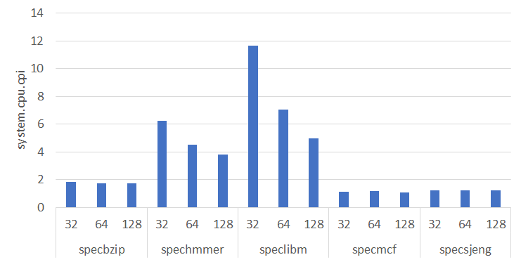

Παρατηρούμε ότι υπάρχει σημαντική μείωση του CPI με αύξηση του Cache Line κυρίως στα spechmmer, speclibm προγράμματα. Στα άλλα η επίπτωση είναι αμελητέα.

* Cache Line effect to data cache miss rate
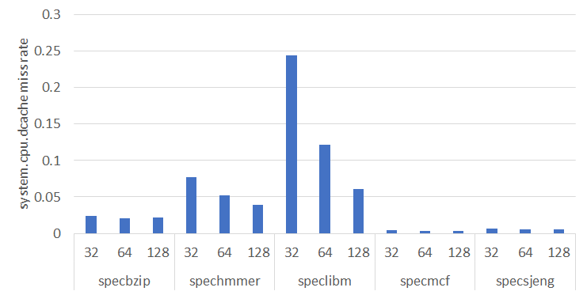

Η επίπτωση και εδώ είναι παρόμοια με παραπάνω. Υπάρχει μείωση του data cache miss rate με αύξηση του Cache Line κυρίως στα spechmmer, speclibm προγράμματα.

* Cache Line effect to instruction cache miss rate
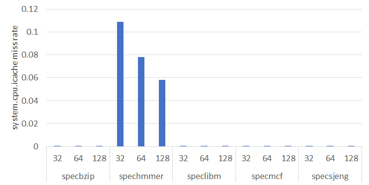

Εδώ βλέπουμε ότι το miss rate υφίσταται πρακτικά μόνο στο spechmmer στο οποίο εμφανίζεται πτώση

* Cache Line effect to L2 overall miss rate
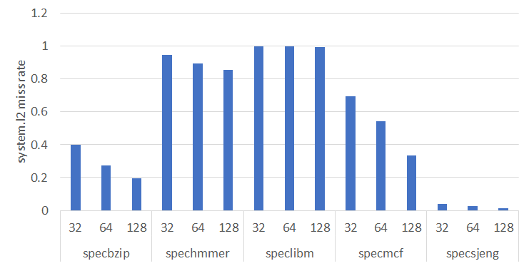

Εκτός του speclibm αύξηση του Cache Line επιφέρει μείωση του L2 overall miss rate σε όλα τα προγράμματα. Πιο έντονη είναι η πτώση στα specbzip, specmcf.

#### L1D size/L1I size

* L1D size/L1I size effect to CPI
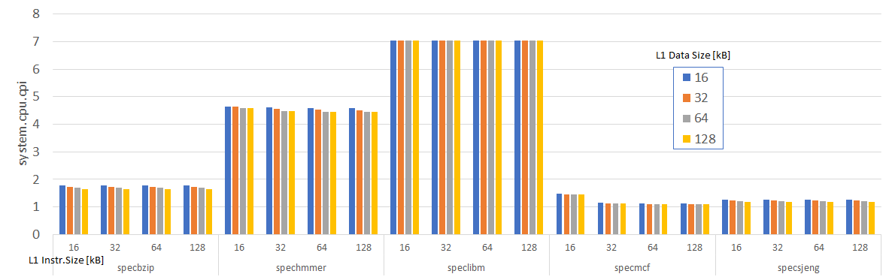

Τα μεγέθη του L1 data/L1 instr. προκαλούν αμελητέα μείωση στο CPI.

* L1D size/L1I size effect to data cache miss rate
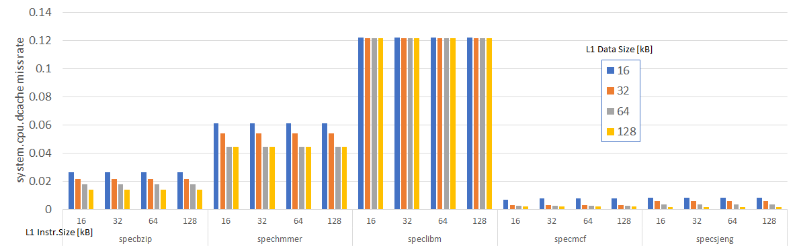

Το μέγεθος του L1 instruction size δεν φαίνεται να επηρεάζει το data cache miss rate. Το L1 data size μειώνει το data cache miss rate σε όλα τα προγράμματα εκτός του speclibm.

* L1D size/L1I size effect to instruction cache miss rate
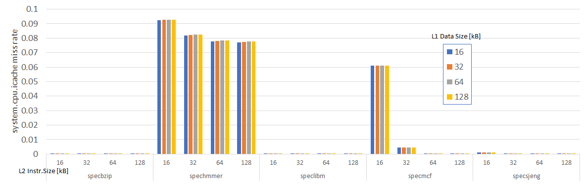

Το μέγεθος του L1 instruction size μειώνει το instruction cache miss rate πάρα πολύ στο specmcf και λιγότερο στο spechmmer. Το L1 data size έχει αμελητέα επίπτωση.

* L1D size/L1I size effect to L2 overall miss rate
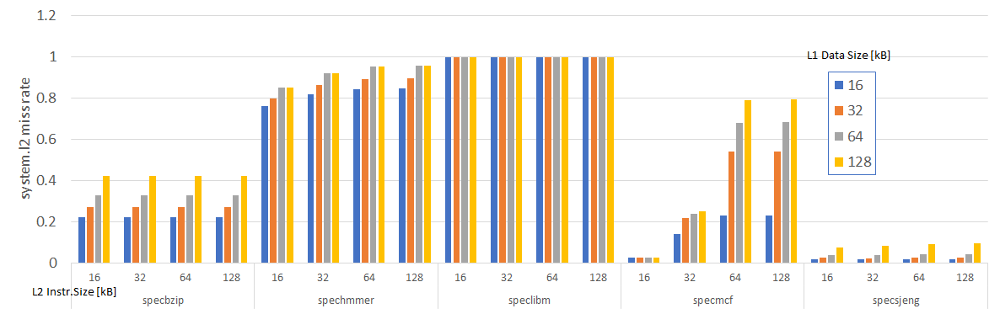

Το L1 instruction size φαίνεται να αυξάνει το L2 miss rate σχεδόν σε όλες τις περιπτώσεις εκτός του speclibm.

#### L1D associativity

* L1D associativity effect to CPI
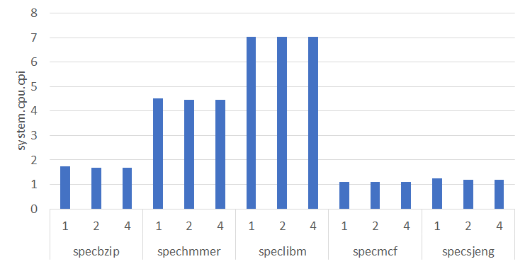

To CPI δεν φαίνεται να επηρεάζεται.

* L1D associativity effect to data cache miss rate
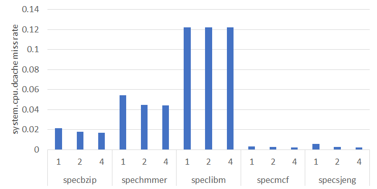

Εμφανίζεται μικρή μείωση του data cache miss rate με την αύξηση του associativity στα spechmmer, specbzip.

* L1D associativity effect to instruction cache miss rate
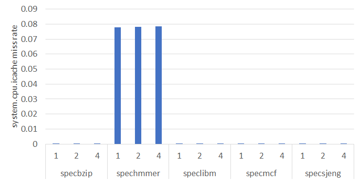

Δεν επηρεάζεται το instruction cache miss rate.

* L1D associativity effect to L2 overall miss rate
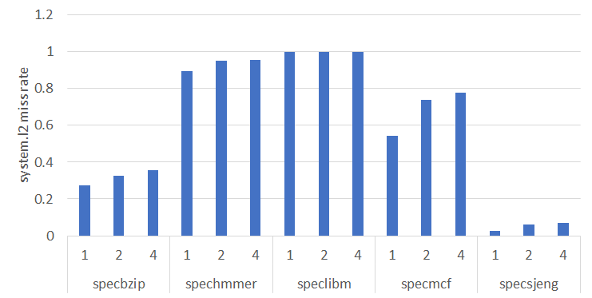

Με την αύξηση του L1D associativity, φαίνεται να αυξάνεται το L2 miss rate στα specbzip, specmcf, spechmmer.

#### L1I associativity

* L1I associativity effect to CPI


To CPI δεν φαίνεται να επηρεάζεται.

* L1I associativity effect to data cache miss rate
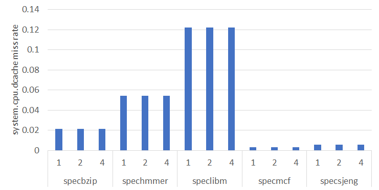

Το data cache miss rate δεν φαίνεται να επηρεάζεται.

* L1I associativity effect to instruction cache miss rate


Δεν επηρεάζεται πρακτικά το instruction cache miss rate.

* L1I associativity effect to L2 overall miss rate
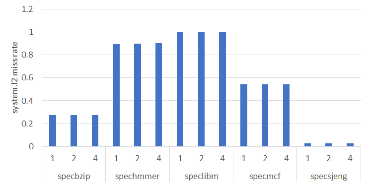

Δεν επηρεάζεται πρακτικά το L2 overall miss rate.

#### L2D associativity

* L2D associativity effect to CPI


To CPI δεν φαίνεται να επηρεάζεται.

* L2D associativity effect to data cache miss rate


Το data cache miss rate δεν φαίνεται να επηρεάζεται.

* L2D associativity effect to instruction cache miss rate
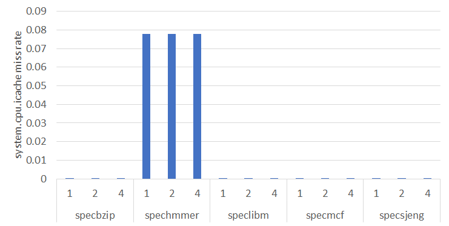

Δεν επηρεάζεται το instruction cache miss rate.

* L2D associativity effect to L2 overall miss rate
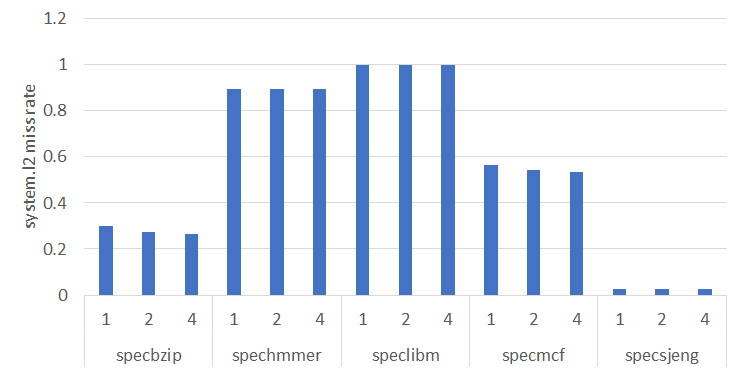

Δεν επηρεάζεται πρακτικά το L2 overall miss rate. Υπάρχει μία πολύ μικρή μείωση στα specbzip, specmcf.

#### L2 size [kB]

* L2 size effect to CPI
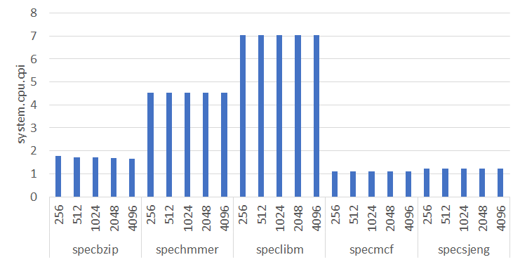

To CPI δεν φαίνεται να επηρεάζεται.

* L2 size effect to data cache miss rate
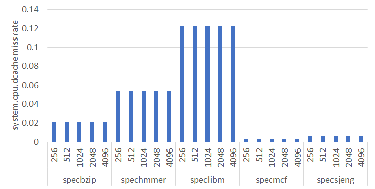

Το data cache miss rate δεν φαίνεται να επηρεάζεται.

* L2 size effect to instruction cache miss rate
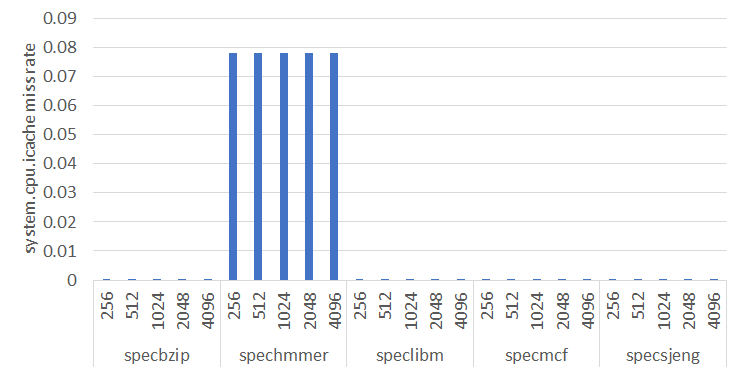

Δεν επηρεάζεται το instruction cache miss rate.

* L2 size effect to L2 overall miss rate
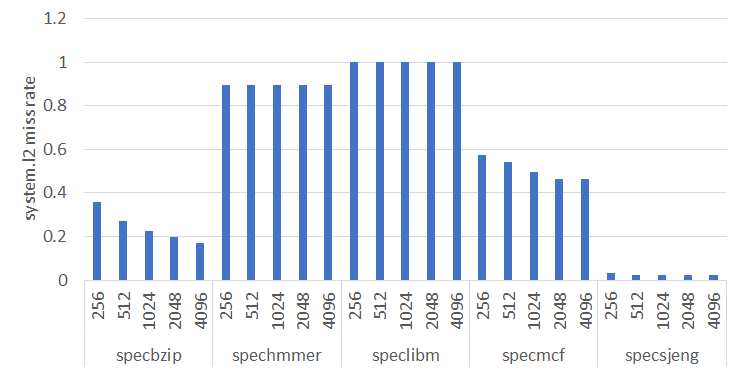

Εμφανίζεται μία μείωση του L2 overall miss rate (με την αύξηση του L2 size) στα specbzip, specmcf.


### Βήμα 3ο Κόστος απόδοσης και βελτιστοποίηση κόστους/απόδοσης
Παρακάτω επισυνάπτεται ο συνολικός πίνακας των αποτελεσμάτων. 

Η βέλτιστη επιλογή των παραμέτρων γίνεται εδώ με βάση το γινόμενο COST\*AMAT. Θέλουμε το λίγοτερο δυνατό κόστος και τον μικρότερο δυνατό χρόνο, συνεπώς η καλύτερη επιλογή για κάθε benchmark είναι εκείνη με την μικρότερη τιμή.
Εναλλακτικά θα μπορούσαμε να πάρουμε την μεγαλύτερη τιμή του λόγου Performance/Cost = 1/ (AMAT x Cost), όπου η απόδοση θα ήταν το 1/AMAT. 
Η σχέση του AMAT προκύπτει από την βιβλιογραφία (_Patterson, Hennessy - Computer Organization and Design, 5th ed., p.402_) βάζοντας συμβατικούς συντελεστές για τα HitRate, αλλά χρησιμοποιώντας τις μετρούμενες τιμές από το gem5 όσον αφορά τα MissRateL1 = (Miss Rate Instruction + Miss Rate Data Cache) και MissRateL2:

**ΑΜΑΤ = HitRateL<sub>1</sub> + MissRateL1 x (HitRateL2 + MissRateL2 x MissPenaltyL2)** ή

**AMAT = 1 + (system.cpu.dcache.overall_miss_rate::total + system.cpu.icache.overall_miss_rate::total) x (10 + system.l2.overall_miss_rate::total
 x 100)**
 
Για το κόστος χρησιμοποιούμε την (εμπειρική) συνάρτηση θεωρώντας δεδομένη περίπου μία τάξη μεγέθους στο κόστος L1, L2:

**COST = (L1 Data Size + L1 Instr Size)/128 x 10 + (L1 Data Assoc)/4 x 10 + (L2 Size)/4096 x 1 + (Cache Line)/128 x 10**

Στα παραπάνω έχουμε ανάγει κάθε μέγεθος αθροιστή σε ένα τυπικό εύρος [0,1] πριν γίνει πολ/σμός με ένα συγκριτικό συντελεστή κόστους.

